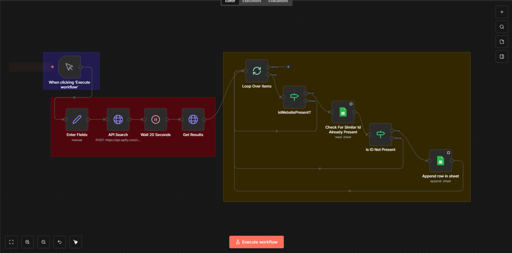
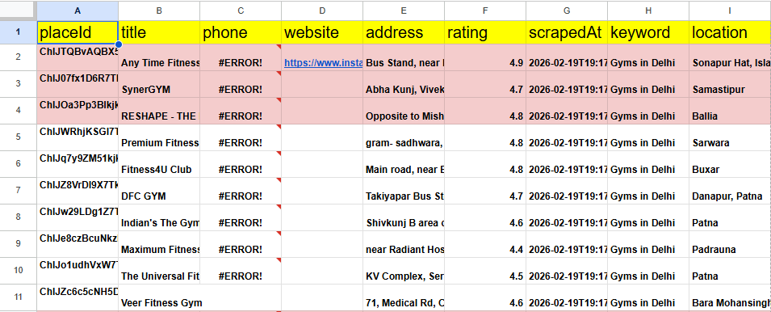

## Google Maps Lead Generation Automation (n8n + Apify + Google Sheets)

This guide is written for YouTube viewers who want to **directly copy this automation** and, at the same time, **understand every single step** without confusion.

By the end, you will have an n8n workflow that:

- **Searches Google Maps** using Apify  
- **Loops through all the results**  
- **Skips businesses that already have a website (or keeps only the ones you want)**  
- **Prevents duplicates** by checking if the lead already exists in your Google Sheet  
- **Appends only fresh leads** into a Google Sheet that you can use for outreach

The workflow you see in the screenshot is exactly what we are documenting here:



---

## 1. Get the Ready‑Made n8n Workflow (JSON)

If you are coming from YouTube and just want to import the workflow and start using it, you can use the JSON file.

**Workflow JSON file (import into n8n):**  
➡️ `https://drive.google.com/file/d/1u_-HI1FIpFzfWlewkqyj_Z4rXcTXcrM-/view?usp=drive_link`

Once you paste your own Google Drive link in the README:

1. Download the JSON file from that link.
2. Open your n8n instance.
3. Click on the **menu (top‑right) → Import from file**.
4. Choose the downloaded JSON file.
5. The full workflow (exactly like the video) will appear in your n8n editor.

You can still keep reading below to understand and customize every single part.

---

## 2. What This Automation Does (High‑Level)

Here is the logic in simple language:

- You **manually start** the workflow in n8n.
- You **enter your search** (for example: *“dentist in ghaziabad”*).
- n8n sends this search to **Apify’s Google Maps Scraper** via API.
- The workflow **waits for Apify to finish** scraping.
- n8n then **pulls all results** from Apify.
- For **each business**, n8n:
  - Checks if a **website is present / not present** (based on how you configure it).  
  - Checks your **Google Sheet** to see if that ID already exists.  
  - If it is **not already in the sheet**, it **appends a new row** with all the details.

So every time you run it, your sheet grows only with **new, filtered leads**.

---

## 3. Prerequisites

Before you start, make sure you have:

- **n8n account** (self‑hosted or cloud).  
- **Apify account** with access to the **Google Maps Scraper** actor.  
- **Google account** with access to **Google Sheets**.  
- Basic understanding of:  
  - How to log in to Apify and copy API tokens.  
  - How to log in to Google and create a new Sheet.

You **do not** need to be a coder. Everything below is step‑by‑step.

---

## 4. Create the Google Sheet for Leads

Your Google Sheet should look **exactly** like this in the first row (headers):



1. Go to **Google Sheets** and create a new sheet.  
2. Give it a clear name like **“Google Maps Leads”**.  
3. In **Row 1**, create these headers **exactly as written**:

   - `placeId` – unique ID of the place from Apify / Google Maps (this is what we use to avoid duplicates).  
   - `title` – business name.  
   - `phone` – phone number (can be blank if not available).  
   - `website` – website URL (if present).  
   - `address` – full address.  
   - `rating` – Google rating (number).  
   - `scrapedAt` – when this row was scraped.  
   - `keyword` – the keyword you searched for (e.g. “Gyms in Delhi”).  
   - `location` – city / area returned from the scrape.

4. Copy the **Spreadsheet ID** from the URL (the long string between `/d/` and `/edit`).  
5. Note the **sheet/tab name** (usually `Sheet1` unless you renamed it).

We will use both the **Spreadsheet ID** and the **Sheet name** in the Google Sheets nodes inside n8n, and we will use **`placeId`** as the unique key to detect duplicates.

---

## 5. Connect Google Sheets to n8n (Very Important)

Many people get stuck here, so follow slowly.

### 5.1 Create Google Sheets credentials in n8n

1. In n8n, open any workflow and add a **Google Sheets** node (you will see it later as `Check For Similar Id Already Present` and `Append row in sheet`).
2. In the **Credentials** dropdown, click **“Add new”**.
3. Choose **Google Sheets OAuth2** (recommended for most users).
4. n8n will show a form with:
  - **Client ID**  
  - **Client Secret**  
  - **Scopes**

### 5.2 Create a Google Cloud project and OAuth credentials

1. Go to **Google Cloud Console** (`https://console.cloud.google.com`).
2. Create a **new project** (for example: `n8n-sheets-automation`).
3. In the left menu, go to **APIs & Services → Enabled APIs & services**.
4. Click **Enable APIs and Services** and search for:
  - **Google Sheets API** → Enable  
  - (Optional but recommended) **Google Drive API** → Enable
5. Go to **APIs & Services → Credentials**.
6. Click **Create Credentials → OAuth client ID**.
7. Application type: **Web application**.
8. Add an **Authorized redirect URI**:
  - Copy the redirect URL that n8n shows in the Google Sheets credential setup screen.  
  - Paste it into the **Authorized redirect URIs** field in Google Cloud.
9. After creating the client, copy:
  - **Client ID**  
  - **Client Secret**

### 5.3 Finish the credential in n8n

1. Go back to n8n → Google Sheets credential setup.
2. Paste **Client ID** and **Client Secret**.
3. Scopes: you can use `https://www.googleapis.com/auth/spreadsheets` (or the value suggested by n8n).
4. Click **Connect OAuth2 Account** (or similar button).
5. A Google popup will appear – log into the Google account that owns the Sheet.
6. Allow the permissions and wait until n8n shows **“Connection successful”**.

Now every Google Sheets node in this workflow can use this credential.

---

## 6. Set Up Apify Google Maps Scraper

1. Go to `https://console.apify.com`.
2. In the **Actors** section, search for **“Google Maps Scraper”**.
3. Open it and click **Try for free / Run**.
4. In the **Input** section, configure:
   - **Example search queries:**

     ```text
     Gyms in Delhi
     Dentists in Ghaziabad
     Coaching centres in Delhi
     Skin clinic in Noida
     ```

   - **Recommended settings:**

     | Setting            | Value / Note          |
     | ------------------ | --------------------- |
     | Max places         | 50–200 (start small)  |
     | Include reviews    | OFF (faster, cheaper) |
     | Include images     | OFF                   |
     | Include owner info | ON                    |

5. Run the actor once manually from Apify to confirm it works.
6. Copy your **Apify API Token** from your Apify account settings.
7. Note down:
  - The **Actor ID** (or name) you are using.  
  - The **Dataset ID** where results are stored (visible in the run details).

The n8n workflow uses these values in the **API Search** and **Get Results** nodes.

---

## 7. Understanding the n8n Workflow (Node by Node)

Look at the screenshot while reading this section – it will make everything crystal clear.

### 7.1 Trigger: `When clicking "Execute workflow"`

- Type: **Manual Trigger**.  
- Purpose: You click **Execute workflow** in n8n when you want to run a new search.

### 7.2 `Enter Fields`

- Usually a **Set** node or similar.  
- Here you define:
  - Your **search term** (e.g. `dentist in ghaziabad`).  
  - Any other fields the Apify API needs (max results, language, etc.).
- This makes it easy to change the query without touching the API settings.

### 7.3 `API Search`

- Typically an **HTTP Request** node calling Apify’s API to **start the Google Maps Scraper run**.  
- It sends the search data from `Enter Fields` to Apify.  
- Output: a **run ID** or reference we can later use to fetch results.

### 7.4 `Wait 20 Seconds`

- A **Wait / Delay** node.  
- Purpose: give Apify enough time to scrape Google Maps.  
- You can adjust the timer depending on:
  - How many places you scrape.  
  - Your Apify plan / speed.

### 7.5 `Get Results`

- Another **HTTP Request** node or **Apify** node.  
- Uses the run or dataset information to **pull all results** from Apify once the scraping is done.  
- After this node, n8n has an array of businesses (items) to process.

### 7.6 `Loop Over Items`

- A node like **Split In Batches** or an **Item Lists** style loop.  
- Purpose: Go through **each business one by one**.  
- Every following node (`IsWebsitePresent?`, Google Sheets checks, etc.) runs once per business.

### 7.7 `IsWebsitePresent?`

This is usually an **IF node** that checks the `website` field of each business.

You can configure it in two ways, depending on your strategy:

- **Option A – Keep ONLY businesses *without* a website (good for selling websites)**  
  - Field: `website`  
  - Operator: `is empty`  
  - Value: *(leave blank)*  
  - TRUE branch = **business has NO website → potential web‑dev client**
- **Option B – Keep ONLY businesses *with* a website (for SEO / marketing offers)**  
  - Field: `website`  
  - Operator: `is not empty`  
  - Value: *(leave blank)*  
  - TRUE branch = **business already has a website**

In the YouTube demo, choose the option that matches what you are selling.

### 7.8 `Check For Similar Id Already Present` (Google Sheets)

- Node type: **Google Sheets → Read rows / Lookup**.  
- Purpose: **Avoid duplicates** in your lead list.

Typical configuration:

1. Use the **Google Sheets credential** you created earlier.
2. Select your **Spreadsheet ID** and **Sheet name**.
3. Use a **Lookup / Read** operation where:
  - You search by the `placeId` column.  
  - The value you search for is the current item’s `placeId` from Apify.

If the `placeId` is found, it means this business is **already in your sheet**.

### 7.9 `Is ID Not Present`

- Another **IF node**.  
- It checks the output from `Check For Similar Id Already Present`.  
- Logic:
  - If **no row is returned** → ID is **not present** → this is a **new lead**.  
  - If a row **is returned** → ID is **already present** → **skip** this lead.

Only the **TRUE branch (ID not present)** moves forward to the final step.

### 7.10 `Append row in sheet`

- Node type: **Google Sheets → Append**.  
- Purpose: **Add the new lead as a fresh row** in your Sheet.

Basic mapping:

- `placeId` → `placeId` column  
- `title` → `title` column  
- `phone` → `phone` column  
- `website` → `website` column  
- `address` → `address` column  
- `rating` → `rating` column  
- `scrapedAt` → `scrapedAt` column (or you can use n8n’s current timestamp).  
- `keyword` → `keyword` column (search phrase you used).  
- `location` → `location` column (city / area from the scrape).

Every time this node runs, your sheet grows by **one unique, filtered lead**.

---

## 8. How to Run the Workflow (From Start to Finish)

1. Open the workflow in n8n (either built manually or imported via JSON).
2. Click on the **Manual Trigger / Execute workflow** button.
3. In the `Enter Fields` node, set your **search phrase** (e.g. city + niche).
4. Click **Execute** and watch each node turn green as it runs.
5. When the workflow finishes:
  - Open your **Google Sheet**.  
  - You should see new rows with leads that match your filters, **without duplicates**.

You can re‑run the same workflow tomorrow with a new query, and it will keep **only new, unique leads** in your sheet.

---

## 9. Customization Ideas

- **Change the niche or location** directly in the `Enter Fields` node.  
- **Store more fields** from Apify (e.g. opening hours, price level) by adding more columns in Google Sheets and mapping them.  
- **Connect a CRM** (HubSpot, Pipedrive, etc.) instead of or in addition to Google Sheets.  
- **Add automatic outreach**:
  - Connect to email / WhatsApp APIs.  
  - Trigger follow‑up messages based on tags or statuses.

---

## 10. Troubleshooting & Common Issues

- **No data is added to Google Sheets**
  - Check that the **Google Sheets credential** is connected successfully.  
  - Make sure the **Spreadsheet ID** and **Sheet name** are correct.  
  - Confirm that `IsWebsitePresent?` and `Is ID Not Present` conditions are not filtering out everything.
- **Apify returns empty results**
  - Try a broader search query.  
  - Reduce `Max places` to test.  
  - Check inside Apify that the run actually completed and returned items.
- **Duplicates are still appearing**
  - Confirm that the **same `id` field** from Apify is being used both in:
    - The Google Sheet `id` column.  
    - The lookup inside `Check For Similar Id Already Present`.
  - Make sure you are not accidentally using a different field (like title or address).

If you follow every step in this README and the YouTube video, you will have a **fully working Google Maps lead generation machine** that keeps filling your Google Sheet with **fresh, non‑duplicate prospects** you can contact for your services.