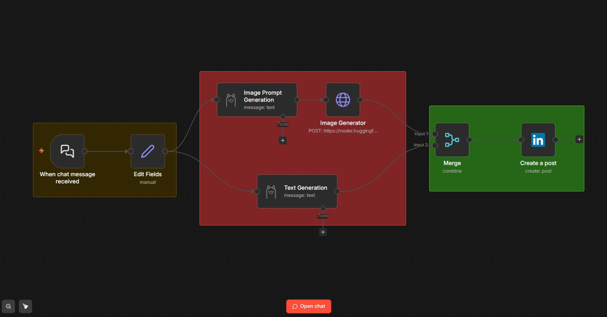

# 🚀 LinkedIn Auto-Poster — n8n Automation Workflow

> **Just type a post idea. AI writes it, illustrates it, and publishes it to LinkedIn — automatically.**




---

## 📌 What This Does

This n8n workflow automates your entire LinkedIn content pipeline:

1. You enter a **post idea** in a simple chat interface
2. **Llama 3.2** (running locally via Ollama) writes a professional, high-engagement LinkedIn post
3. **FLUX.1-schnell** (via HuggingFace) generates a matching AI image
4. The post + image is **automatically published** to your LinkedIn profile

No manual writing. No Canva. No copy-pasting. Just one idea → live post.

---

## 🗺️ Workflow Architecture

```
Chat Input
    │
    ▼
Edit Fields (inject bio + post idea)
    │
    ├──────────────────────────────────┐
    ▼                                  ▼
Text Generation              Image Prompt Generation
(Llama 3.2 via Ollama)       (Llama 3.2 via Ollama)
    │                                  │
    │                                  ▼
    │                         Image Generator
    │                         (FLUX.1 via HuggingFace)
    │                                  │
    └──────────────┬───────────────────┘
                   ▼
                 Merge
                   │
                   ▼
           Create LinkedIn Post
           (Text + Image published)
```

---

## ⚙️ Prerequisites

Before you start, make sure you have:

- [ ] **n8n** installed and running (self-hosted or n8n Cloud)
- [ ] **Ollama** installed locally with Llama 3.2 pulled
- [ ] A **HuggingFace** account with a free API token
- [ ] A **LinkedIn Developer App** with OAuth 2.0 credentials

---

## 📥 Step-by-Step Setup

### Step 1 — Download the Workflow File

1. Go to the [**Google Drive link**](https://drive.google.com/file/d/12-KWOAuAjhVAfbMo4EkA3Vsr3Ex6AO6d/view?usp=drive_link)
2. Download the file: `05_Linkedin_Poster.json`
3. Save it somewhere easy to find (Desktop or Downloads folder)

---

### Step 2 — Import into n8n

1. Open your n8n instance in the browser
2. Click **+** (top right) to create a new workflow
3. Click the **⋮ menu** → **Import from File**
4. Select the downloaded `05_Linkedin_Poster.json`
5. The full workflow will load with all nodes pre-configured

---

### Step 3 — Connect Your Ollama Account

1. Click the **Text Generation** node
2. Under Credentials → click **Create New** → **Ollama API**
3. Enter your Ollama base URL (default: `http://localhost:11434`)
4. Save and repeat for the **Image Prompt Generation** node

> Make sure Ollama is running with: `ollama serve`  
> Pull the model if you haven't: `ollama pull llama3.2`

---

### Step 4 — Add Your HuggingFace API Token

1. Click the **Image Generator** node (HTTP Request)
2. Find the `Authorization` header field
3. Replace `YOUR_HUGGINGFACE_API_TOKEN` with your actual token
4. Get your token at: [huggingface.co/settings/tokens](https://huggingface.co/settings/tokens)

> The free tier is enough — just make sure the token has **Read** access.

---

### Step 5 — Connect Your LinkedIn Account (Updated)

1. Set `App Name` to your product name, e.g., **Kunal AI Lab**.
2. Create a LinkedIn Company Page, become **Super Admin**, and paste the page URL in the notes.
3. Set the Privacy Policy link to:
   `https://www.notion.so/Privacy-Policy-Kunal-AI-Lab-1ce6d589199d8060bf4de2b2a6cdbe5b?source=copy_link`
4. Upload your app image (logo/screenshot).
5. In product access, enable **Sign in with OAuth** and **Share On Linkedin**
6. Add the redirect URL in Auth, e.g., `http://localhost:11434/callback` for Ollama (port 11434).
7. Verify your organization details in settings (name and domain check).

---

### Step 6 — Add Your Personal Bio

1. Click the **Edit Fields** node
2. Find the field named **My Description**
3. Replace the placeholder text with **your own professional bio**

> This is the most important step. The AI uses your bio to tailor every post to your personal brand, tone, and expertise. The more detail you provide, the better the output.

---

### Step 7 — Activate & Test

1. Click the **Active** toggle (top right) to enable the workflow
2. Open the **Chat widget URL** shown in the Chat Trigger node
3. Type a post idea, for example:

   > *"Why AI will not replace creative marketers"*

4. Wait 20–40 seconds while the AI generates text + image
5. Check your LinkedIn profile — the post should be live! ✅

---

## 🧩 Node Reference

| Node | Type | Purpose |
|------|------|---------|
| When chat message received | Chat Trigger | Entry point — receives your post idea |
| Edit Fields | Set Node | Injects your bio + post idea into variables |
| Text Generation | Ollama (Llama 3.2) | Writes the LinkedIn post copy |
| Image Prompt Generation | Ollama (Llama 3.2) | Creates a visual concept prompt |
| Image Generator | HTTP Request | Calls FLUX.1 API to generate the image |
| Merge | Merge Node | Combines generated text + image |
| Create a Post | LinkedIn Node | Publishes the final post to LinkedIn |

---

## 🔧 Troubleshooting

| Issue | Fix |
|-------|-----|
| Ollama not connecting | Run `ollama serve` and verify URL is `http://localhost:11434` |
| HuggingFace 401 error | Regenerate your token and check it has inference permissions |
| LinkedIn post not appearing | Re-authenticate LinkedIn OAuth — tokens expire after a few weeks |
| Image generation timeout | FLUX.1 can be slow on cold starts — wait 30s and retry |
| Post is too long / too short | Edit the prompt inside the Text Generation node |

---

## 📁 Files in This Download

```
📦 LinkedIn Auto-Poster
 ├── 05_Linkedin_Poster_CLEAN.json   ← Import this into n8n
 └── README.md                       ← This file
 ├── image.png                       ← Workflow image
 └── README.md                       ← This file
```

---

## ⚠️ Important Notes

- **Never share your workflow JSON with credentials filled in** — always export a clean version
- The HuggingFace free tier has rate limits — for heavy use, consider the Pro tier
- LinkedIn OAuth tokens expire periodically — reconnect if posting stops working
- This workflow runs the LLM **locally** via Ollama — your post ideas never leave your machine

---

## 📺 Watch the Full Tutorial

Follow along step-by-step on YouTube — link in the video description.

If this helped you, **leave a like and subscribe** — it helps a lot! 🙏

---

*Built with n8n · Ollama · HuggingFace FLUX.1 · LinkedIn API*